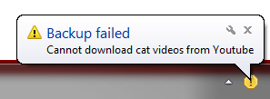

# TrayMsg

This is a simple tool which shows tray notifications and stacks them so that all non-dismissed notifications are displayed each time you run the program.

You can run it for example from a Task Scheduler, when some kind of unfavorable condition (e.g. some event log records) is detected.

**[Download latest version](https://drive.google.com/folderview?id=0B6e6N2yLg25MRWVmaWlhUHVJdEk&usp=sharing)**

How to use:
~~~~
traymsg /add "Caption" "Message text" "url://where.to.go"
traymsg /add "Caption" "Message text" "C:\\Path\\Filename"
~~~~

A tray notification will immediately be displayed and a yellow warning icon will appear in the tray. If the app is already running, it will just add this warning to the list.

If you click the icon, a window pops up with all unresolved warnings. The list stays the same even after reboot.

To prevent the icon from being shown if it's not already running, add:
~~~~
traymsg /add "Caption" "Message text" "Action" /norun
~~~~

Next time you run the app without arguments, it will display all warnings queued in the meanwhile.

This is still in development so something may be broken, don't be wary to report bugs here.